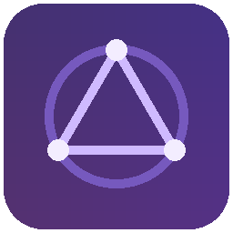
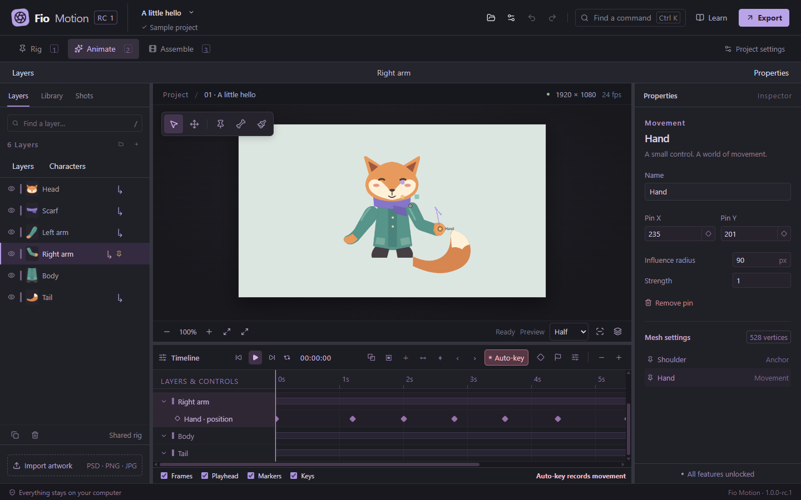

<p align="center"></p>
<h1 align="center">Fio Motion</h1>
<p align="center">Draw a character. Bring it to life.</p>
<p align="center"><a href="https://justypixels.github.io/fio-motion/">Website & demo</a> · <a href="https://github.com/JustyPixels/fio-motion/releases">Download for Windows</a> · <a href="https://justypixels.github.io/fio-motion/guide/">Get started</a> · <a href="README.pt-BR.md">Português brasileiro</a></p>

[](https://justypixels.github.io/fio-motion/#demo)

Fio Motion is an offline 2D character animation editor for Windows, made by JustyPixels. Keep your artwork in separate layers, connect the pieces and animate with puppet pins, bones and smooth keyframes.

Free, fully unlocked and no account needed. The original code is [MIT-licensed](LICENSE).

## Try it

[Download the installer or portable build](https://github.com/JustyPixels/fio-motion/releases), or [watch the studio tour](https://justypixels.github.io/fio-motion/#demo). The support archive includes example characters and offline guides.

The current build is **1.0.0-rc.2**, an unsigned release candidate for testing. Windows may display a trust warning. Read the [release notes](docs/RELEASE-NOTES.md) for measurements, known limitations and checks still pending.

## Inside the studio

- **Rig:** import PNG, JPEG, WebP or supported layered PSD artwork. Connect pieces yourself or use the humanoid assistant.
- **Animate:** create poses, edit Bézier timing curves, adjust motion paths and reuse animation. New movement keys start with smooth easing.
- **Assemble:** arrange shots, add WAV/MP3 audio and camera moves, then export MP4 or transparent PNG sequences.

The canvas keeps your project's aspect ratio. The interface supports Brazilian Portuguese, English, Spanish, French, German, Japanese and Simplified Chinese. Existing supported `.puppet` projects remain readable.

## Run from source

```powershell
npm ci
npm start
```

The WebAssembly engine is included. See the [build guide](docs/BUILD.md) for Rust rebuilding, FFmpeg setup, Windows packages and website previews.

## Help improve it

[Report a bug](https://github.com/JustyPixels/fio-motion/issues) or read [the contribution guide](CONTRIBUTING.md). Small, reproducible examples help; keep private artwork out of public reports.

[Compatibility](docs/COMPATIBILITY.md) · [Architecture](docs/ARCHITECTURE.md) · [MIT license](LICENSE) · [Third-party notices](THIRD-PARTY-NOTICES.txt)
